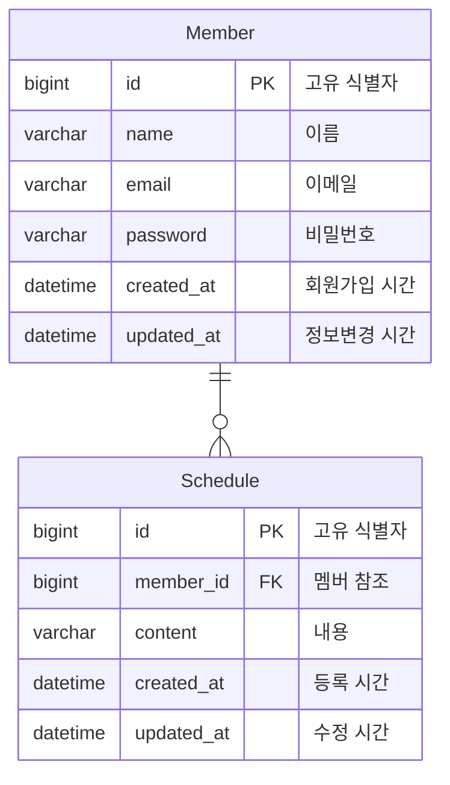

# 일정 관리 API 서버

이 서비스는 JDBC Template이라는 SQL 매퍼를 사용하여 MySQL 데이터베이스에 접근하여,  
일정 생성, 조회, 수정, 삭제 (CRUD) API를 제공합니다.

- 프로젝트 기간: 2024.12.05 ~ 2024.12.10
- 기술 스택:
    - Java 17
    - Spring Boot 3.4.0
    - JdbcTemplate
    - MySQL 8.0
- 구현 결과

  

## 구현 과정

아래 링크를 통해 각 단계별 브랜치로 이동하여 코드를 확인하실 수 있습니다.

| 단계                                                                                            | 내용                                                   |
|-----------------------------------------------------------------------------------------------|------------------------------------------------------|
| [Level 1, 2](https://github.com/yeongbinim/SchedulerProject/tree/lv2_schedule-crud)ㅤㅤㅤ        | (🎁 feature) **사용자는 일정을 CRUD 할 수 있다.**               |
| [Level 3](https://github.com/yeongbinim/SchedulerProject/tree/lv3_member-normalization)ㅤㅤㅤ    | (🛠 refactor) 작성자를 일정과 분리해서 관리                       |
| [Level 4](https://github.com/yeongbinim/SchedulerProject/tree/lv4_paging-schedule-list)ㅤㅤㅤㅤ   | (🛠 refactor) 효율적으로 표시하기 위해 데이터를 여러 페이지로 나눔          |
| [Level5, 6](https://github.com/yeongbinim/SchedulerProject/tree/lv6_exception-validation)ㅤㅤㅤㅤ | (🎁 feature) **예외 발생에 대한 적절한 코드를 응답하고, 요청에 대해 검증한다** |

## ERD

[[Member DDL 바로가기]](./sql/member_ddl.sql)   [[Schedule DDL 바로가기]](./sql/schedule_ddl.sql)

## API 명세

<table>
<thead>
<tr>
<th>METHOD</th>
<th>URI</th>
<th>DESCRIPTION</th>
<th>요청</th>
<th>응답</th>
</tr>
</thead>
<tbody>
<tr>
<td><code>POST</code></td>
<td>/api/schedules</td>
<td>일정 생성</td>
<td>
<pre>{
  "content": "생성할 데이터"
}</pre>
</td>
<td>
201 Created
<pre>
Location: /api/schedules/1
</pre>
</td>
</tr>
<tr>
<td><code>GET</code></td>
<td>/api/schedules</td>
<td>모든 일정 조회</td>
<td><code>?page={page}&size={size}</code></td>
<td>
200_OK

body

<pre>{
  "content":[{
    "id": 1,
    "author": "yeim",
    "content": "사용자 입력 데이터",
    "createdAt": "2024-12-06T20:39:46",
    "updatedAt": "2024-12-10T01:42:57"
  }, ...],
  "currentPage": 0,
  "pageSize": 10,
  "totalElements": 11,
  "totalPages": 2
}</pre>

</td>
</tr>
<tr>
<td><code>GET</code></td>
<td>/api/schedules/{id}</td>
<td>특정 일정 조회</td>
<td></td>
<td>
200 OK

body

<pre>{
    "id": 1,
    "author": "yeim",
    "content": "사용자 입력 데이터",
    "createdAt": "2024-12-06T20:39:46",
    "updatedAt": "2024-12-10T01:42:57"
}</pre>

</td>
</tr>
<tr>
<td><code>PUT</code></td>
<td>/api/schedules/{id}</td>
<td>일정 수정</td>
<td>
<pre>{
  "content": "수정된 데이터",
  "password": "password123"
}</pre>
</td>
<td>
200 OK

body
<pre>{
    "id": 1,
    "author": "yeim",
    "content": "수정된 데이터",
    "createdAt": "2024-12-06T20:39:46",
    "updatedAt": "2024-12-10T01:42:57"
}</pre>

</td>
</tr>
<tr>
<td><code>DELETE</code></td>
<td>/api/schedules/{id}</td>
<td>일정 삭제</td>
<td>
<pre>{
  "password": "password123"
}</pre>
</td>
<td>
204 No Content
</td>
</tr>
</tbody>
</table>
