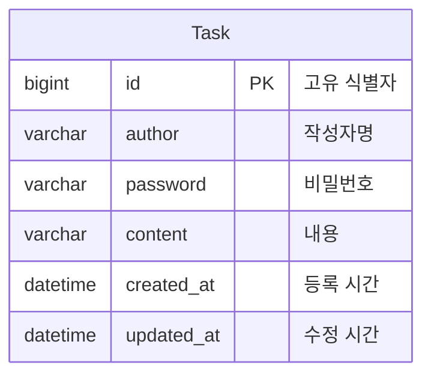

# LV2: 일정 CRUD

## 구현 사항
- (기능) 사용자는 일정을 추가, 조회, 수정, 삭제할 수 있다.
  - `POST /api/schedules`
  - `GET /api/schedules`
  - `GET /api/schedules/{id}`
  - `PUT /api/schedules/{id}`
  - `DELETE /api/schedules/{id}`

- (기술) MySQL 연동
  - DB 접근 기술로는 JDBC Template 사용
  - applications-env.yml 따로 만들어서 접근 정보 은닉화

## 구현 결과

- POST

  
- GET all

  
- GET

  
- PUT

  
- DELETE

  

## ERD 설계

