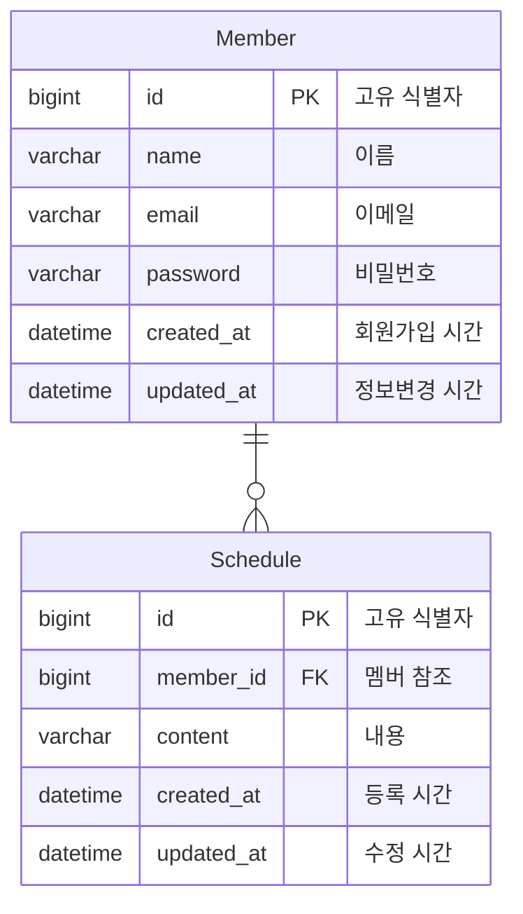

# Lv3: 작성자를 일정과 분리 (정규화)

## 구현 사항

- Member 엔티티 추가
- Schedule이 Member를 바라보도록 변경
- 테스트를 위한 Ajax 통신을 하는 프론트 JS 파일 작성

## 구현 결과

## ERD 설계

```mermaid
erDiagram
Member {
	bigint id PK "고유 식별자"
	varchar name "이름"
	varchar email "이메일"
	varchar password "비밀번호"
	datetime created_at "회원가입 시간"
	datetime updated_at "정보변경 시간"
}

Schedule {
	bigint id PK "고유 식별자"
	bigint member_id FK "멤버 참조"
	varchar content "내용"
	datetime created_at "등록 시간"
	datetime updated_at "수정 시간"
}

Member ||--o{ Schedule : " "
```
